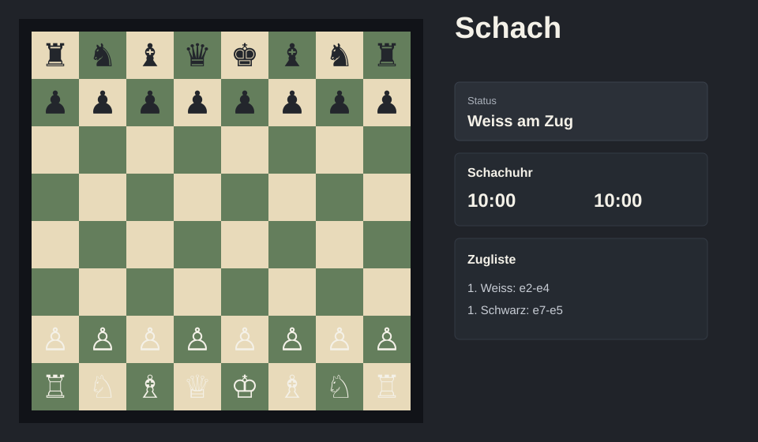

# Schach

C# WPF-Schachspiel mit eigener GUI, lokaler Partie und optionalem KI-Gegner.



## Funktionen

- Vollstaendiges 8x8-Schachbrett mit Klicksteuerung.
- Legale Zuege inklusive Schachschutz, Schachmatt und Patt.
- Rochade, En passant und automatische Bauernumwandlung zur Dame.
- KI-Gegner in drei Stufen: Leicht, Mittel, Schwer.
- Rechtsklick-Markierungen auf Feldern mit mehreren Farben.
- Zugliste, letzter Zug und geschlagene Figuren.
- Schachuhr mit 10 Minuten pro Seite.
- Spielstand speichern/laden und PGN exportieren/importieren.
- Hell-/Dunkel-Brettdarstellung und Brettdrehung.

## Build

```powershell
dotnet build .\Schach.slnx
```

## Tests

```powershell
dotnet test .\Schach.slnx
```

## Release

Siehe [docs/release.md](docs/release.md).

## Projektstruktur

- `AI/`: KI-Schwierigkeitsgrade und Bewertungslogik.
- `Logic/`: Spielregeln, Figuren, Zuege, Spielende und Historie.
- `UI/`: Schachbrett-Komponente und Interaktion.
- `Visuals/`: Farben, Themes und Markierungsfarben.
- `Persistence/`: Spielstand, PGN und Einstellungen.
- `Tests/`: Unit-Tests fuer Kernregeln.

## Spaetere Ideen

- Freie Auswahl der Umwandlungsfigur statt automatischer Dame.
- Optionale Engine-Anbindung, z. B. UCI-kompatible Engines.
- Erweiterte PGN-Unterstuetzung mit Standard-SAN statt koordinatenbasierter Notation.
